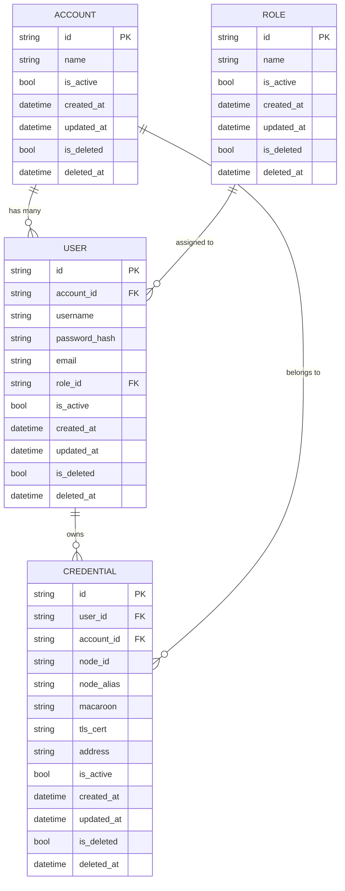

# Database Schema

This document describes the database schema and relationships for the NodeGaze backend.

## Entity Relationship Diagram

```mermaid
erDiagram
    ACCOUNT {
        string id PK
        string name
        bool is_active
        datetime created_at
        datetime updated_at
        bool is_deleted
        datetime deleted_at
    }
    
    USER {
        string id PK
        string account_id FK
        string username
        string password_hash
        string email
        string role_id FK
        bool is_active
        datetime created_at
        datetime updated_at
        bool is_deleted
        datetime deleted_at
    }
    
    ROLE {
        string id PK
        string name
        bool is_active
        datetime created_at
        datetime updated_at
        bool is_deleted
        datetime deleted_at
    }
    
    CREDENTIAL {
        string id PK
        string user_id FK
        string account_id FK
        string node_id
        string node_alias
        string macaroon
        string tls_cert
        string address
        bool is_active
        datetime created_at
        datetime updated_at
        bool is_deleted
        datetime deleted_at
    }
    
    ACCOUNT ||--o{ USER : "has many"
    ROLE ||--o{ USER : "assigned to"
    USER ||--o{ CREDENTIAL : "owns"
    ACCOUNT ||--o{ CREDENTIAL : "belongs to"
```